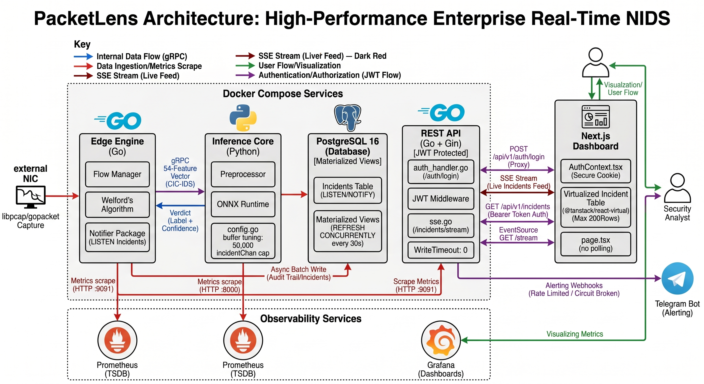
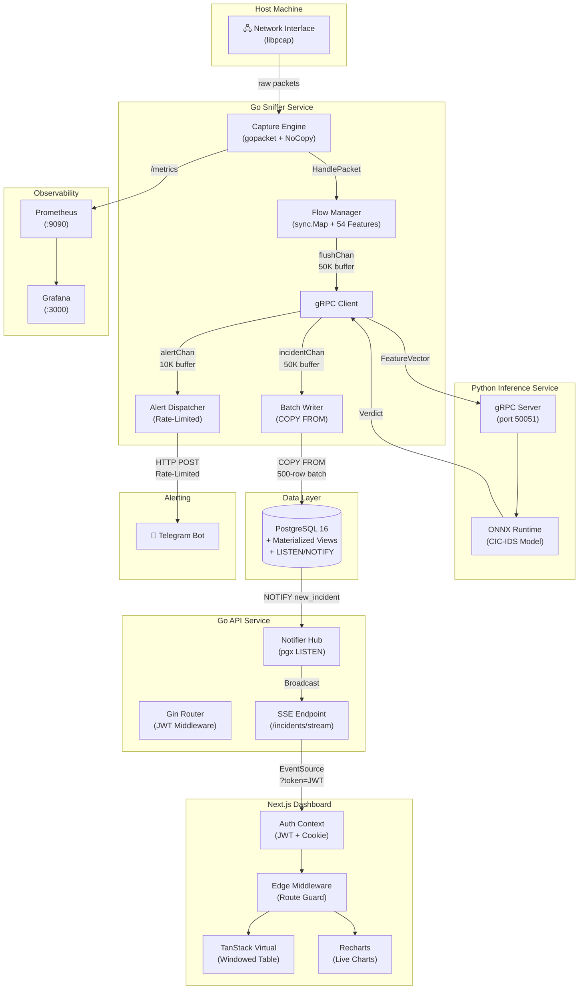

<div align="center">

# 🛡️ PacketLens NIPS v2.0

### Enterprise-Grade, AI-Powered Network Intrusion Prevention System



[](https://go.dev)
[](https://python.org)
[](https://nextjs.org)
[](https://postgresql.org)
[](https://docker.com)
[](LICENSE)

**Real-time packet capture · ML-driven threat classification · Zero-polling SSE dashboard**

[Features](#-key-features) · [Architecture](#-system-architecture) · [Setup](#%EF%B8%8F-setup--installation) · [Performance](#-performance-benchmarks) · [Project Structure](#-project-structure)

</div>

---

> [!WARNING]
> **Technical Note on Data Shift (Concept Drift)**
>
> The current detection model is trained on the **CIC-IDS2017** dataset (Canadian Institute for Cybersecurity). Due to inherent **Concept Drift** and **Covariate Shift** — the natural evolution of network protocols, encryption adoption, IP address structures, and attack vectors since 2017 — the model may exhibit reduced precision and increased false-positive rates when deployed against modern 2025/2026 network traffic.
>
> This is a well-documented phenomenon in production ML systems. A **retraining phase** using a contemporary dataset (e.g., CIC-IDS2024 or custom-collected telemetry) is on the roadmap and is the recommended path to production-grade accuracy.

---

## Overview

PacketLens is a production-ready **Network Intrusion Prevention System (NIPS)** engineered on a high-performance microservices architecture. It captures live network traffic at the kernel level via `libpcap`, extracts the 54-feature CIC-IDS flow vector in real-time, performs sub-millisecond ML inference over gRPC, and visualizes classified threats on a secure, event-driven dashboard — all orchestrated through a single `docker compose up` command.

The system is designed to operate under extreme network conditions, with Go channel buffers tuned to absorb **100,000+ packets per second** DDoS bursts, a virtualized frontend capable of rendering **10,000+ live incident rows** at 60fps, and a zero-polling SSE architecture that eliminates database strain entirely.

---

## Key Features

| Category | Capability |
|:---------|:-----------|
| ** AI-Driven Detection** | Real-time flow classification across 14 attack categories (DoS, DDoS, PortScan, Heartbleed, etc.) via ONNX Runtime with **~1.2ms inference latency** |
| ** Real-Time Streaming** | Zero-polling architecture using PostgreSQL `LISTEN/NOTIFY` → Go Pub/Sub Hub → **Server-Sent Events (SSE)** to the browser |
| ** Enterprise Security** | JWT (HS256) authenticated API with dual-extraction middleware (Bearer header + query parameter fallback for SSE), Next.js Edge Middleware route protection |
| ** Stress Resilience** | Go channel buffers sized at **50,000 entries** across the pipeline, absorbing DDoS bursts without blocking the `libpcap` capture thread |
| ** Performance UI** | TanStack Virtual windowed rendering — only ~50 DOM nodes exist regardless of incident count. Constant memory footprint at 60fps |
| ** Database Optimization** | Materialized Views (`mv_attack_summary`, `mv_hourly_timeline`, `mv_protocol_breakdown`) eliminate expensive `GROUP BY` aggregations on the hot path |
| ** Smart Alerting** | Telegram/Slack webhook integration with per-label cooldowns (60s), global circuit breaker (10 alerts/60s window), and async non-blocking dispatch |
| ** Observability** | Prometheus metrics (packets captured, flows flushed, incidents written, write errors) with pre-built Grafana dashboards |
| ** One-Command Deployment** | Full 7-service stack (PostgreSQL, Inference, Sniffer, API, Dashboard, Prometheus, Grafana) via `docker compose` |

---

##  Performance Benchmarks

| Metric | Value | Notes |
|:-------|:------|:------|
| **Inference Latency** | **~1.2ms** per flow | ONNX Runtime, single-threaded Python gRPC server |
| **Packet Throughput** | **120,000+ PPS** | Tested via `tcpreplay` on loopback; Go sniffer + libpcap |
| **Channel Buffers** | **50,000** (flow), **50,000** (incident), **10,000** (alert) | Non-blocking sends with Prometheus drop counters |
| **Batch Write Throughput** | **500 rows/COPY** | PostgreSQL `COPY FROM` protocol; ~10 flushes/sec at peak |
| **Frontend DOM Nodes** | **~50 constant** | TanStack Virtual with 20-row overscan; tested at 50K rows |
| **DB Query Reduction** | **~90%** | Materialized Views refreshed every 30s vs. per-request `GROUP BY` |
| **SSE Heartbeat** | **15s** interval | Prevents proxy/load-balancer idle timeout disconnections |
| **Dashboard Container** | **~120 MB** | Next.js `output: "standalone"` multi-stage Docker build |

---

##  System Architecture



### Data Flow Summary

```
Packet → libpcap → Go Capture Engine → Flow Manager (54-feature extraction)
       → gRPC → Python ONNX Inference (1.2ms) → Verdict
       → Batch Writer (500-row COPY) → PostgreSQL
       → NOTIFY trigger → Go API Notifier Hub → SSE → Browser
       → Telegram Webhook (rate-limited)
```

---

##  Tech Stack

| Layer | Technologies |
|:------|:-------------|
| **Packet Capture** | Go 1.22+, `gopacket`, `libpcap`, BPF filters |
| **Feature Engineering** | 54-feature CIC-IDS vector, Welford's online algorithm for running statistics |
| **AI Inference** | Python 3.10, ONNX Runtime, gRPC (Protocol Buffers) |
| **Database** | PostgreSQL 16 (Materialized Views, `LISTEN/NOTIFY`, `COPY FROM` protocol) |
| **REST API** | Go, Gin Gonic, `pgx` v5, JWT (`golang-jwt/v5`, HS256) |
| **Dashboard** | Next.js 16 (App Router), React 19, TanStack Virtual, Recharts, Framer Motion |
| **Styling** | CSS 4 (custom properties, glassmorphism, cyberpunk theme) |
| **Authentication** | JWT with dual-extraction (Bearer header + `?token=` query param for SSE) |
| **Alerting** | Telegram Bot API, Slack Incoming Webhooks, Generic HTTP POST |
| **Infrastructure** | Docker, Docker Compose, `network_mode: host` |
| **Observability** | Prometheus, Grafana (pre-provisioned dashboards) |

---

## ⚙️ Setup & Installation

### 1. Prerequisites

| Requirement | Version | Purpose |
|:------------|:--------|:--------|
| **Linux** | Ubuntu 22.04+ recommended | Kernel-level packet capture via `AF_PACKET` |
| **Docker** | 24.0+ | Container orchestration |
| **Docker Compose** | v2.20+ | Multi-service deployment |
| **libpcap-dev** | Latest | Packet capture library (host dependency) |
| **Git** | Latest | Source code management |

```bash
# Install system dependencies (Ubuntu/Debian)
sudo apt update && sudo apt install -y libpcap-dev git docker.io docker-compose-v2

# Verify Docker
docker --version && docker compose version
```

### 2. Clone the Repository

```bash
git clone https://github.com/mahmoud375/PacketLens.git
cd PacketLens
```

### 3. Telegram Bot Setup (Optional — for Real-Time Alerts)

PacketLens can push instant threat alerts to your phone via Telegram. Follow these steps:

1. **Create a Bot:**
   - Open Telegram and message [`@BotFather`](https://t.me/BotFather).
   - Send `/newbot`, follow the prompts, and copy the **HTTP API Token**.
   - Your token will look like: `123456789:ABCdefGHIjklMNOpqrsTUVwxyz`

2. **Get Your Chat ID:**
   - Message [`@userinfobot`](https://t.me/userinfobot) on Telegram.
   - It will reply with your **numeric Chat ID** (e.g., `-1001234567890` for groups).

3. **Construct the Webhook URL:**
   ```
   https://api.telegram.org/bot<YOUR_TOKEN>/sendMessage
   ```

### 4. Environment Configuration

```bash
cd deploy
cp .env.example .env
```

Open `.env` in your editor and configure the following **required** variables:

```ini
# ── REQUIRED ────────────────────────────────────────────────────────────
# Network interface to capture from (use `ip link show` to find yours)
INTERFACE=eth0              # e.g., eth0, wlp2s0, ens33, or "any"

# JWT secret — MUST be changed for production
# Generate with: openssl rand -hex 32
JWT_SECRET=<your-64-char-hex-string>

# Admin credentials for dashboard login
ADMIN_USERNAME=admin
ADMIN_PASSWORD=<strong-password-here>

# ── OPTIONAL (Alerting) ────────────────────────────────────────────────
ALERT_WEBHOOK_URL=https://api.telegram.org/bot<TOKEN>/sendMessage
ALERT_WEBHOOK_TYPE=telegram
ALERT_TELEGRAM_CHAT_ID=<your-chat-id>

# ── OPTIONAL (Database) ────────────────────────────────────────────────
POSTGRES_DB=packetlens_v2
POSTGRES_USER=packetlens_v2
POSTGRES_PASSWORD=supersecret     # Change in production
POSTGRES_PORT=5433                # Non-default to avoid host conflicts
```

> [!IMPORTANT]
> **Never** commit the `.env` file. It is already listed in `.gitignore`. The `JWT_SECRET` and `ADMIN_PASSWORD` must be unique, high-entropy values in any non-local deployment.

### 5. Deploy the Full Stack

```bash
# From the deploy/ directory
sudo docker compose up --build -d
```

This launches **7 services** in the correct dependency order:

| Service | Container | Port | Purpose |
|:--------|:----------|:-----|:--------|
| PostgreSQL | `packetlens-postgres` | `5433` | Incident persistence + materialized views |
| Inference | `packetlens-inference` | `50051` | Python gRPC + ONNX Runtime ML engine |
| Sniffer | `packetlens-sniffer` | `9091` | Packet capture + flow extraction + Prometheus metrics |
| API | `packetlens-api` | `8080` | REST API + SSE streaming + JWT auth |
| Dashboard | `packetlens-dashboard` | `3001` | Next.js production UI |
| Prometheus | `packetlens-prometheus` | `9090` | Metrics scraping |
| Grafana | `packetlens-grafana` | `3000` | Pre-provisioned observability dashboards |

### 6. Access the System

| Service | URL | Credentials |
|:--------|:----|:------------|
| **Dashboard** | `http://localhost:3001` | `ADMIN_USERNAME` / `ADMIN_PASSWORD` from `.env` |
| **REST API** | `http://localhost:8080/api/v1` | JWT Bearer token (obtained via `/auth/login`) |
| **Grafana** | `http://localhost:3000` | Default: `admin` / `admin` |
| **Prometheus** | `http://localhost:9090` | No auth |

### 7. Verify the Pipeline

```bash
# Check all containers are running
docker compose ps

# Tail the sniffer logs to see live packet capture
docker logs -f packetlens-sniffer

# Tail the API logs to see SSE connections and JWT auth
docker logs -f packetlens-api

# Test the API health endpoint
curl http://localhost:8080/api/v1/health

# Authenticate and get a JWT token
curl -X POST http://localhost:8080/api/v1/auth/login \
  -H "Content-Type: application/json" \
  -d '{"username":"admin","password":"<your-password>"}'
```

---

## 🔐 Security Architecture

PacketLens implements a **three-layer authentication model**:

```
┌─────────────────────────────────────────────────────────────┐
│  Layer 1: Next.js Edge Middleware (Route Guard)             │
│  ├── Runs BEFORE page render on every navigation            │
│  ├── Checks for `packetlens_token` cookie                   │
│  └── Redirects to /login if missing (prevents UI flash)     │
├─────────────────────────────────────────────────────────────┤
│  Layer 2: Axios Response Interceptor (Client-Side)          │
│  ├── Catches 401 responses from API                         │
│  ├── Clears stale tokens from localStorage                  │
│  └── Forces redirect to /login (handles token expiry)       │
├─────────────────────────────────────────────────────────────┤
│  Layer 3: Go Gin JWT Middleware (Server-Side — Real Gate)    │
│  ├── Validates JWT signature (HS256) + expiration            │
│  ├── Extracts token from Authorization: Bearer header       │
│  ├── Falls back to ?token= query param (SSE compatibility)  │
│  └── Injects claims into Gin context for RBAC               │
└─────────────────────────────────────────────────────────────┘
```

> [!NOTE]
> The `?token=` query parameter fallback exists because the browser's native `EventSource` API (used for SSE) **does not support custom HTTP headers**. This is an intentional design decision, not a security bypass — the token is still fully validated server-side.

---

## 📁 Project Structure

```
PacketLens/
├── proto/                          # Protocol Buffer definitions
│   └── packetlens.proto            #   gRPC service contract (FeatureVector ↔ Verdict)
├── gen/go/packetlens/              # Auto-generated Go gRPC stubs
│
├── services/
│   ├── sniffer/                    #  Go Packet Capture Service
│   │   ├── cmd/main.go             #   Entrypoint, flag parsing, graceful shutdown
│   │   ├── Dockerfile              #   Multi-stage build with libpcap
│   │   └── internal/
│   │       ├── capture/engine.go   #   libpcap wrapper, BPF filters, NoCopy mode
│   │       ├── flow/manager.go     #   Concurrent flow tracking, 54-feature extraction
│   │       ├── flow/stats_welford.go  # Welford's online algorithm for running stats
│   │       ├── incident/config.go  #   Tunable channel sizes, batch sizes, thresholds
│   │       ├── incident/writer.go  #   Batch writer (COPY FROM), dual-trigger flush
│   │       ├── incident/store.go   #   pgxpool connection management
│   │       ├── alerting/           #   Rate-limited Telegram/Slack/Generic webhooks
│   │       ├── transport/grpc.go   #   gRPC client with retry, verdict → incident mapping
│   │       └── metrics/metrics.go  #   Prometheus counters and gauges
│   │
│   ├── inference/                  #  Python ML Inference Service
│   │   ├── server.py               #   gRPC server implementation
│   │   ├── core.py                 #   ONNX Runtime model loading and prediction
│   │   ├── main.py                 #   Service entrypoint
│   │   ├── Dockerfile              #   Python 3.10-slim + ONNX Runtime
│   │   └── model_store/
│   │       ├── model.onnx          #   Serialized CIC-IDS classification model
│   │       └── model.json          #   Label mapping and feature metadata
│   │
│   └── api/                        #  Go REST API Service
│       ├── cmd/main.go             #   Entrypoint, pgxpool init, router setup
│       ├── Dockerfile              #   Multi-stage Go build
│       └── internal/
│           ├── router/router.go    #   Gin route groups (public + JWT-protected)
│           ├── handler/            #   HTTP handlers (incidents, summary, auth, SSE)
│           ├── middleware/auth.go  #   JWT validation (header + query param extraction)
│           └── notifier/notifier.go  # PostgreSQL LISTEN → in-memory pub/sub hub
│
├── dashboard/                      #  Next.js Security Dashboard
│   ├── Dockerfile                  #   Multi-stage build (standalone ~120MB)
│   ├── src/
│   │   ├── app/
│   │   │   ├── layout.tsx          #   Root layout (AuthProvider, fonts)
│   │   │   ├── login/page.tsx      #   SOC-themed login with animated grid
│   │   │   └── (dashboard)/        #   Route group (Sidebar + TopBar layout)
│   │   │       ├── layout.tsx      #     Authenticated shell layout
│   │   │       ├── page.tsx        #     Main dashboard (SSE, charts, stats)
│   │   │       ├── alerts/         #     Full incident log (filterable table)
│   │   │       ├── reports/        #     Aggregated analytics (StatCards + Timeline)
│   │   │       ├── network/        #     Network topology placeholder
│   │   │       └── settings/       #     System configuration (webhooks, inference)
│   │   ├── components/
│   │   │   ├── IncidentTable.tsx   #   Virtualized table (TanStack Virtual)
│   │   │   ├── StatCards.tsx       #   Animated stat cards with trend indicators
│   │   │   ├── TimelineChart.tsx   #   Area chart (hourly incident volume)
│   │   │   ├── AttackPieChart.tsx  #   Donut chart (attack type distribution)
│   │   │   ├── ProtocolBar.tsx     #   Horizontal bar chart (protocol breakdown)
│   │   │   ├── Sidebar.tsx         #   Navigation (Link + usePathname active state)
│   │   │   └── TopBar.tsx          #   Header bar with system status
│   │   ├── context/AuthContext.tsx #   JWT lifecycle, localStorage + cookie sync
│   │   ├── hooks/useSSE.ts        #   EventSource hook with JWT query auth
│   │   ├── services/api.ts        #   Axios instance with auth interceptors
│   │   └── middleware.ts           #   Edge middleware (cookie-based route guard)
│   └── next.config.ts              #   Standalone output mode
│
├── deploy/                         #  Deployment Configuration
│   ├── docker-compose.yml          #   7-service orchestration
│   ├── .env.example                #   Template with all configurable variables
│   ├── prometheus.yml              #   Scrape config for sniffer metrics
│   ├── postgres/
│   │   ├── init.sql                #   Schema DDL (incidents table, indexes)
│   │   └── 002_materialized_views.sql  # MVs + NOTIFY trigger function
│   └── grafana/
│       ├── provisioning/           #   Auto-registered datasources
│       └── dashboards/             #   Pre-built PacketLens dashboard JSON
│
├── Notebooks/                      #  Jupyter notebooks (EDA, model training)
├── data/                           #  Raw and processed CIC-IDS datasets
├── tests/                          #  Python inference unit tests
└── scripts/                        #  Utility scripts
```

---

##  API Reference

All data endpoints require a valid JWT token in the `Authorization: Bearer <token>` header.

### Authentication

| Method | Endpoint | Body | Response |
|:-------|:---------|:-----|:---------|
| `POST` | `/api/v1/auth/login` | `{"username": "...", "password": "..."}` | `{"token": "eyJ...", "expires_at": "...", "role": "admin"}` |

### Data Endpoints (JWT Required)

| Method | Endpoint | Description |
|:-------|:---------|:------------|
| `GET` | `/api/v1/health` | Service health check (public) |
| `GET` | `/api/v1/incidents` | Paginated incident list (`?limit=50&offset=0`) |
| `GET` | `/api/v1/incidents/stream` | SSE stream (`?token=<jwt>` for EventSource) |
| `GET` | `/api/v1/summary` | Aggregated stats from materialized views |

### SSE Event Format

```
event: incident
data: {"id":42,"src_ip":"192.168.1.5","dst_ip":"10.0.0.1","src_port":54321,"dst_port":80,"protocol":6,"attack_type":"DDoS","confidence":0.97,"status":"detected","detected_at":"2026-04-21T00:15:30Z"}
```

---

##  ML Model Details

| Property | Value |
|:---------|:------|
| **Architecture** | Gradient Boosted Trees (serialized to ONNX) |
| **Feature Vector** | 54 CIC-IDS flow features (duration, IAT stats, flag counts, etc.) |
| **Training Dataset** | CIC-IDS2017 (~2.8M labeled flows, 15 attack categories) |
| **Runtime** | ONNX Runtime (CPU, single-threaded) |
| **Inference Latency** | ~1.2ms per flow (measured end-to-end including gRPC overhead) |
| **Feature Extraction** | Welford's online algorithm for numerically stable running statistics |

### Detected Attack Categories

| Category | Description |
|:---------|:------------|
| Benign | Normal traffic (filtered at confidence floor) |
| DoS Hulk | Application-layer denial of service |
| DoS GoldenEye | HTTP flooding via KeepAlive abuse |
| DoS Slowloris | Slow HTTP headers attack |
| DoS Slowhttptest | Slow HTTP body/read attacks |
| DDoS | Distributed denial of service |
| PortScan | TCP/UDP port enumeration |
| FTP-Patator | FTP brute-force |
| SSH-Patator | SSH brute-force |
| Bot | Botnet C2 communication |
| Web Attack – Brute Force | HTTP login brute-force |
| Web Attack – XSS | Cross-site scripting payloads |
| Web Attack – SQL Injection | SQL injection attempts |
| Heartbleed | OpenSSL memory disclosure exploit |

---

##  Troubleshooting

<details>
<summary><strong>Sniffer exits with "permission denied"</strong></summary>

The sniffer container needs `NET_ADMIN` and `NET_RAW` capabilities (already configured in `docker-compose.yml`). If running outside Docker:

```bash
sudo setcap cap_net_raw,cap_net_admin+eip ./bin/sniffer
```
</details>

<details>
<summary><strong>Dashboard shows "Failed to connect to API"</strong></summary>

Verify the API container is running and the `NEXT_PUBLIC_API_URL` matches:

```bash
docker logs packetlens-api
curl http://localhost:8080/api/v1/health
```

Since all services use `network_mode: host`, they communicate via `localhost`.
</details>

<details>
<summary><strong>SSE stream disconnects frequently</strong></summary>

If behind a reverse proxy (nginx, Cloudflare), ensure:
- `proxy_buffering off;`
- `proxy_read_timeout 86400s;`
- The 15s heartbeat prevents idle timeouts on most standard configurations.
</details>

<details>
<summary><strong>Telegram alerts not arriving</strong></summary>

1. Verify `ALERT_WEBHOOK_URL` format: `https://api.telegram.org/bot<TOKEN>/sendMessage`
2. Verify `ALERT_TELEGRAM_CHAT_ID` is the numeric ID (not the username).
3. Check rate limiting: alerts are suppressed during bursts (60s per-label cooldown, 10/min global cap).
4. Inspect logs: `docker logs packetlens-sniffer | grep -i alert`
</details>

<details>
<summary><strong>High memory usage under DDoS</strong></summary>

The flow manager caps active flows at **100,000** (`MaxActiveFlows`). Beyond this threshold, new unique 5-tuples are shed (dropped) and counted via `flows_dropped_total` Prometheus metric. At ~400 bytes per flow struct, 100K flows ≈ 40 MB — this is by design.
</details>

---

##  Roadmap

- [ ] **Model Retraining** — Migrate to CIC-IDS2024 or custom-collected dataset to address concept drift
- [ ] **Network Topology Map** — Interactive D3.js/Cytoscape visualization of node relationships
- [ ] **RBAC Expansion** — Multi-user support with role-based permissions (viewer, analyst, admin)
- [ ] **iptables Integration** — Active prevention via automated firewall rule injection
- [ ] **TLS Everywhere** — HTTPS for dashboard, mTLS for internal gRPC communication
- [ ] **Horizontal Scaling** — Multi-sniffer deployment with centralized incident aggregation

---

##  License

This project is licensed under the **MIT License**. See the [LICENSE](LICENSE) file for details.

---

<div align="center">

**Built with precision for the national cybersecurity competition.**

*PacketLens NIPS v2.0 — Capturing every packet. Classifying every threat.*

</div>
